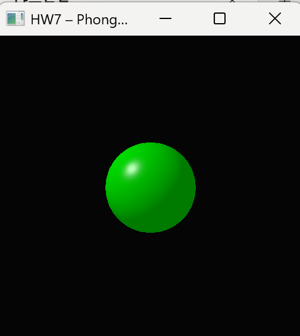

# Assignment 7 – OpenGL Shader Implementation  
**Computer Graphics HW7 – Single-sphere Phong-shading pipeline (OpenGL 3.3 Core)**

## Goals
- Build the entire rendering pipeline **only** with C++ + GLSL (vertex & fragment shaders) under **OpenGL 3.3 Core Profile**.  
- **Re-use** the sphere geometry and transformation setup from **HW5**, and feed the Phong-shading parameters from **HW6** to the GPU via uniforms so the final frame *perfectly* matches the HW6 screenshot.  
- **Absolutely no fixed-function calls** (`glMatrixMode`, `glLight*`, `glMaterial*`, etc.). Everything is **programmable**.

---

## Project layout
.
├── main_Phong_Shader.cpp # driver code – sphere generation + uniform uploads
├── Phong.vert # vertex shader – world transform & MVP
├── Phong.frag # fragment shader – Phong lighting + gamma
└── README.md # this document

---

## Build / Run

### Required libraries

| Library | Tested Version | Notes                              |
|---------|---------------|------------------------------------|
| GLFW    | 3.3.x         | Cross-platform window / input      |
| GLAD    | —             | OpenGL 3.3 **Core** loader         |
| GLM     | 0.9.9+        | Header-only math library           |

> **Tip**: Use your package manager (`vcpkg`, Homebrew, apt, pacman, …) or supply the paths manually with `-I` / `-L` flags.

## Key implementation points
Topic	Location in code	Details
Sphere mesh	createSphere()	Same tessellation as HW5 (32 × 16), 6-float stride (position + normal)
Projection	main_Phong_Shader.cpp	glm::frustum(-0.1, 0.1, -0.1, 0.1, 0.1, 1000) – maps HW5 values for a pixel-perfect match
Gamma correction	Phong.frag	uniform float uGamma = 2.2; → pow(color, 1.0 / uGamma) then enable GL_FRAMEBUFFER_SRGB
Uniform upload	main_Phong_Shader.cpp	Ka, Kd, Ks, shininess, Ia, light pos, eye pos, gamma all sent via glUniform* calls
No fixed-function	Everywhere	Pure Core Profile; no legacy functions

## Result

## Runtime keys
Key	Action
F	Toggle GL_FRAMEBUFFER_SRGB (compare linear vs sRGB output)
ESC	Quit application
